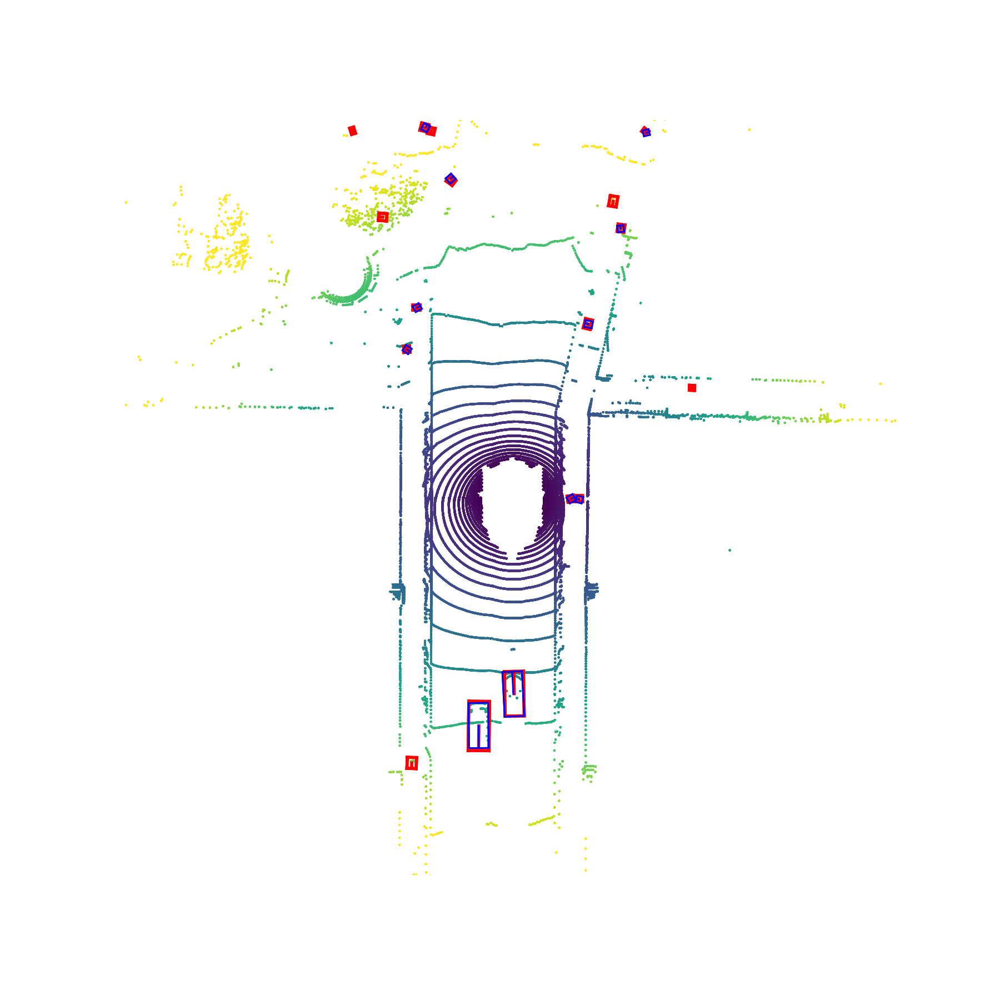

# Centerpoint Pointpillars For TensorRT From ONNX

## Running the sample

1. Generate the onnx model ```pointpillars_trt.onnx```  for tensrorrt.
```
git lfs clone https://github.com/CarkusL/CenterPoint.git
python tools/merge_pfe_rpn_model.py
```
2. Prepare the tensorrt environment. I use the [nvcr.io/nvidia/tensorrt:21.02-py3](https://docs.nvidia.com/deeplearning/tensorrt/container-release-notes/running.html) image.
	```
	docker pull nvcr.io/nvidia/tensorrt:21.02-py3
	docker run --gpus all -it --rm -v local_dir:container_dir nvcr.io/nvidia/tensorrt:21.02-py3 /bin/bash
	```
3. (optinal)  Generate the tensorrt input file by ```TensorRT_Visualize.ipynb``` to get input points.bin in ```CenterPoint/tensorrt/data/centerpoint```
4. Copy these ```CenterPoint/tensorrt/sample/centerpoint``` and ```CenterPoint/tensorrt/data/centerpoint``` to Tensorrt root folder. If you use the docker image in Step 1, the folder should be ```/usr/src/tensorrt/```.
5. Compile this sample by running `make` in the `<TensorRT root directory>/samples/centerpoint` directory. The binary named `centerpoint` will be created in the `<TensorRT root directory>/bin` directory.
	```
	cd <TensorRT root directory>/samples/centerpoint
	make
	```

	Where `<TensorRT root directory>` is where you installed TensorRT.

6.  Run the sample to build and run the MNIST engine from the ONNX model.
	```
	./centerpoint
	```

7.  Verify that the sample ran successfully. If the sample runs successfully you should see output similar to the following:
	```
	&&&& RUNNING TensorRT.sample_onnx_centerpoint # ./centerpoint
	[07/18/2021-03:01:37] [I] Building and running a GPU inference engine for CenterPoint
	[07/18/2021-03:01:45] [I] [TRT] ----------------------------------------------------------------
	[07/18/2021-03:01:45] [I] [TRT] Input filename:   ../data/centerpoint/pointpillars_trt.onnx
	[07/18/2021-03:01:45] [I] [TRT] ONNX IR version:  0.0.6
	[07/18/2021-03:01:45] [I] [TRT] Opset version:    11
	[07/18/2021-03:01:45] [I] [TRT] Producer name:    pytorch
	[07/18/2021-03:01:45] [I] [TRT] Producer version: 1.7
	[07/18/2021-03:01:45] [I] [TRT] Domain:           
	[07/18/2021-03:01:45] [I] [TRT] Model version:    0
	[07/18/2021-03:01:45] [I] [TRT] Doc string:       
	[07/18/2021-03:01:45] [I] [TRT] ----------------------------------------------------------------
	[07/18/2021-03:01:45] [W] [TRT] /home/jenkins/workspace/OSS/L0_MergeRequest/oss/parsers/onnx/onnx2trt_utils.cpp:226: Your ONNX model has been generated with INT64 weights, while TensorRT does not natively support INT64. Attempting to cast down to INT32.
	[07/18/2021-03:01:45] [I] [TRT] No importer registered for op: ScatterND. Attempting to import as plugin.
	[07/18/2021-03:01:45] [I] [TRT] Searching for plugin: ScatterND, plugin_version: 1, plugin_namespace: 
	[07/18/2021-03:01:45] [I] [TRT] Successfully created plugin: ScatterND
	[07/18/2021-03:01:52] [I] [TRT] Some tactics do not have sufficient workspace memory to run. Increasing workspace size may increase performance, please check verbose output.
	[07/18/2021-03:02:04] [I] [TRT] Detected 2 inputs and 36 output network tensors.
	[07/18/2021-03:02:04] [I] getNbInputs: 2 

	[07/18/2021-03:02:04] [I] getNbOutputs: 36 

	[07/18/2021-03:02:04] [I] getNbOutputs Name: 594 

	[07/18/2021-03:02:04] [I] [INFO] pointNum : 219288
	[07/18/2021-03:02:04] [I] ----Run Times: 0 -------
	[07/18/2021-03:02:04] [I] PreProcess Time: 9.49699 ms
	[07/18/2021-03:02:04] [I] inferenceDuration Time: 7.45804 ms
	[07/18/2021-03:02:04] [I] ----Run Times: 1 -------
	[07/18/2021-03:02:04] [I] PreProcess Time: 8.28448 ms
	[07/18/2021-03:02:04] [I] inferenceDuration Time: 6.89017 ms
	[07/18/2021-03:02:04] [I] ----Run Times: 2 -------
	[07/18/2021-03:02:04] [I] PreProcess Time: 7.53015 ms
	[07/18/2021-03:02:04] [I] inferenceDuration Time: 6.86127 ms
	[07/18/2021-03:02:04] [I] ----Run Times: 3 -------
	[07/18/2021-03:02:04] [I] PreProcess Time: 8.234 ms
	[07/18/2021-03:02:04] [I] inferenceDuration Time: 6.80122 ms
	[07/18/2021-03:02:04] [I] ----Run Times: 4 -------
	[07/18/2021-03:02:04] [I] PreProcess Time: 7.27291 ms
	[07/18/2021-03:02:04] [I] inferenceDuration Time: 7.03656 ms
	[07/18/2021-03:02:04] [I] ----Run Times: 5 -------
	[07/18/2021-03:02:04] [I] PreProcess Time: 8.04644 ms
	[07/18/2021-03:02:04] [I] inferenceDuration Time: 7.5022 ms
	[07/18/2021-03:02:04] [I] ----Run Times: 6 -------
	[07/18/2021-03:02:04] [I] PreProcess Time: 7.58605 ms
	[07/18/2021-03:02:04] [I] inferenceDuration Time: 7.23838 ms
	[07/18/2021-03:02:04] [I] ----Run Times: 7 -------
	[07/18/2021-03:02:04] [I] PreProcess Time: 8.3272 ms
	[07/18/2021-03:02:04] [I] inferenceDuration Time: 6.86685 ms
	[07/18/2021-03:02:04] [I] ----Run Times: 8 -------
	[07/18/2021-03:02:04] [I] PreProcess Time: 7.46301 ms
	[07/18/2021-03:02:04] [I] inferenceDuration Time: 6.68977 ms
	[07/18/2021-03:02:04] [I] ----Run Times: 9 -------
	[07/18/2021-03:02:04] [I] PreProcess Time: 8.2625 ms
	[07/18/2021-03:02:04] [I] inferenceDuration Time: 7.11477 ms
	[07/18/2021-03:02:04] [I] Average PreProcess Time: 8.05037 ms
	[07/18/2021-03:02:04] [I] Average Inference Time: 7.04592 ms
	&&&& PASSED TensorRT.sample_onnx_centerpoint # ./centerpoint
8. Copy the \<TensorRT root directory>/data/centerpoint back the CenterPoint/tensorrt/data
9. Run the ```TensorRT_Visualize.ipynb``` to visualiza tensorrt result.
10. Compare the [TensorRT result](../../../demo/trt_demo/file00.png) with [Pytorch result](../../../demo/torch_demo/file00.png).

|  TensoRT  | Pytroch  |
|  :----:  | :----:  |
|   |  |
